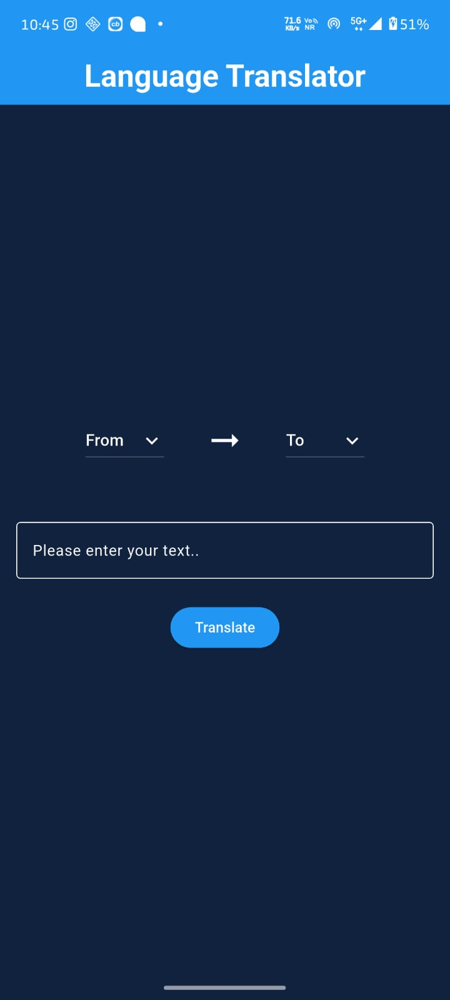
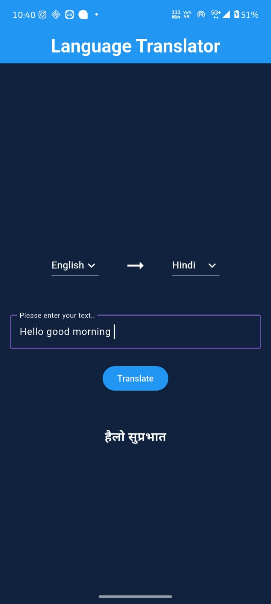
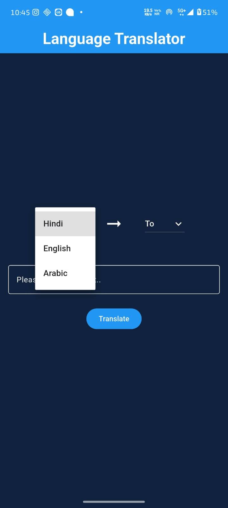

# 🌍 Language Translator App (Flutter)

A powerful and easy-to-use **Language Translator Mobile Application** built using Flutter 🚀  
This app allows users to translate text from one language to another instantly.

---

## 📌 🔗 Live Preview
👉 (Add APK link / Demo video link here)

---

## 📖 About the Project

The **Language Translator App** helps users translate text between multiple languages in real-time.  
It uses API integration to provide accurate and fast translations.

---

## 🛠️ Tech Stack

- 💙 Flutter (Dart)
- 🌐 REST API (Translation API)
- 📦 HTTP Package
- 🎨 Material UI

---

## ✨ Features

- 🌍 Multi-language Translation
- ⚡ Fast & Real-time Translation
- 📱 User-friendly Interface
- 🔄 Swap Languages Option
- 📝 Text Input & Output
- 📋 Copy Translated Text

---

## 📸 Screenshots

### 🏠 Home Screen5


### 🔄 Translation Screen


### 🌐 Language Selection


---

## ⚙️ Installation & Setup

1. Clone the repository
```bash
git clone https://github.com/Nikhil-codes43/language_translator.git